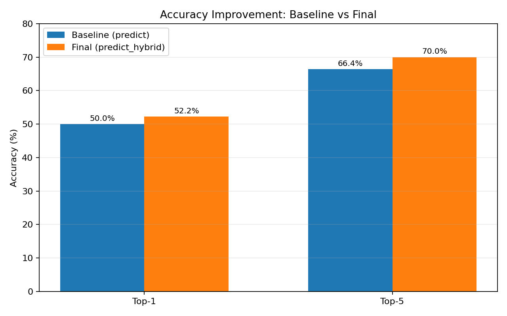
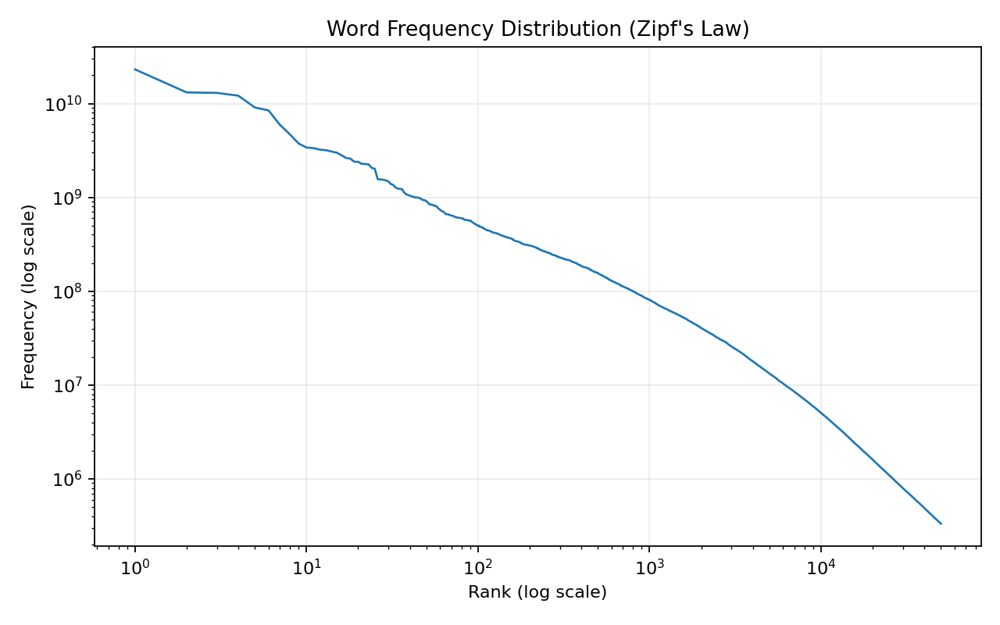
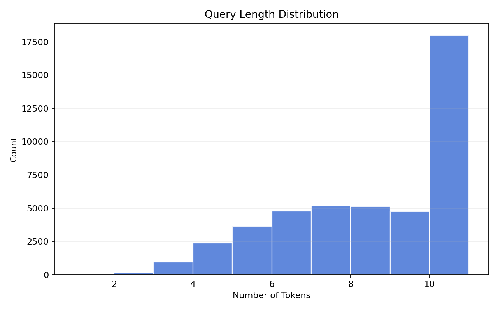

# Keyboard Suggestion System

## Problem Statement
Autocomplete quality drops quickly on technical queries when the context is short or unseen. This project builds a production-style next-word suggestion system for Stack Overflow-like search queries and returns the top likely continuations for a partial query.

## Approach Overview
The system combines statistical language modeling with retrieval fallback:

- Trigram language model for context-aware next-word prediction.
- Kneser-Ney smoothing for robust probability estimates on sparse n-grams.
- TF-IDF fallback for low-confidence or unseen contexts.
- Optional tag-aware reranking and hybrid GPT-assisted inference in the notebook pipeline.

## Dataset Description
- Stack Overflow title dataset (`data/raw/train.csv`) used as training corpus.
- Unigram frequency dataset (`data/raw/unigram_freq.csv`) used as prior signal for reranking and safe fallback.

## System Design
### 1. Preprocessing
- Lowercase normalization.
- Punctuation/character cleanup.
- Deduplication of titles.
- Length filtering to keep query-like sequences.

### 2. Model Training
- Trigram model (`n=3`) built with Kneser-Ney smoothing.
- Serialized artifacts for deployment (`models/*.pkl`).

### 3. Prediction Logic
- Primary path: context-based trigram continuation scoring.
- Secondary path: TF-IDF nearest-title fallback when trigram evidence is weak.
- Ranking blend with unigram priors and optional tag signals.

### 4. Hybrid Ranking Mechanism
- `predict_hybrid()` merges statistical and GPT-derived suggestions.
- Rank-fusion weighting keeps deterministic top-N outputs in deployment mode.

## Evaluation
Core metrics used in this repository:

- **Top-5 Accuracy**: whether the true next word appears in top 5 suggestions.
- **Top-1 Accuracy**: whether the first suggestion is correct.

Recent validated run (inference-only, 800 sampled next-word pairs from `train.csv`):

- Baseline model (`predict`) Top-1: **50.0%**
- Baseline model (`predict`) Top-5: **66.4%**
- Final model (`predict_hybrid`) Top-1: **52.2%**
- Final model (`predict_hybrid`) Top-5: **70.0%**

## Example Outputs
Sample outputs from `outputs/test_cases.json`:

| Query | Top 5 Suggestions |
|---|---|
| machine learning | query, algorithm, string, algorithms, in |
| python | the, how, and, get, to |
| deep | the, learning, ly, nested, and |
| data science | general, and, the, in, of |
| how to | get, a, use, create, make |
| javascript | and, function, to, how, a |
| neural network | in, for, with, loss, using |
| sql | and, server, of, query, to |
| git | and, lab, in, commit, is |
| pandas dataframe | to, in, with, column, is |
| react | native, the, js, and, to |
| sorting algorithm | for, in, to, of, the |
| docker | and, compose, container, in, for |
| api design | the, with, of, for, and |
| natural language | the, for, of, and, to |

## Visualizations

### Accuracy Improvement (Baseline vs Final)


### Word Frequency Distribution (Zipf's Law)


### Query Length Distribution


## Strengths and Limitations
### Strengths
- Strong performance on structured technical multi-word contexts.
- Deterministic ranking and stable deployment behavior.
- Graceful degradation via fallback strategies.

### Limitations
- Accuracy drops for nonsense/very-short unseen inputs.
- Domain drift requires periodic retraining.
- Generative augmentation (if enabled) can introduce noisy candidates.

## Improvements Tried During Development
- Discount and smoothing tuning for trigram modeling.
- Unigram-prior reranking with rarity penalty.
- Tag-aware score blending.
- Data augmentation strategies.
- Prediction path optimizations for runtime stability.

## How to Run
### 1. Setup
```bash
python3 -m venv .venv
.venv/bin/python -m pip install -r requirements.txt
```

### 2. Run Notebook
```bash
HF_HUB_DISABLE_SSL_VERIFICATION=1 .venv/bin/python -m jupyter nbconvert \
	--to notebook --execute --inplace \
	--ExecutePreprocessor.timeout=0 \
	notebooks/keyword_suggestion.ipynb
```

### 3. Run Standalone Inference
```bash
.venv/bin/python app.py "machine learning"
```

## Web Demo

Run the application entirely in browser mode with a FastAPI backend and a React frontend.

### 1. Start Backend API (port 8000)
From the repository root:

```bash
.venv/bin/python -m uvicorn backend.main:app --host 0.0.0.0 --port 8000 --reload
```

API endpoint:

- `POST /predict`
- Request body:

```json
{
	"query": "machine learning"
}
```

- Response body:

```json
{
	"suggestions": ["query", "algorithm", "string", "algorithms", "in"]
}
```

### 2. Start Frontend (port 5173)
Open a second terminal:

```bash
cd frontend
npm install
npm run dev
```

Open `http://localhost:5173` in your browser.

### 3. Example Usage

1. Type `machine learning` in the input box.
2. Suggestions are fetched automatically with a 300ms debounce.
3. Top 5 suggestions appear in the dropdown below the input.

## Model Weights
Large model artifacts are hosted externally to keep this repository lightweight for submission.

- Download placeholder: https://drive.google.com/drive/folders/1gJOcbp59nX0bLDFwjfecFnKa2ZFJoHZy?usp=drive_link
- Required weight files:
	- `models/ngram_weights.pkl`
	- `models/tfidf_vectorizer.pkl`
	- `models/tfidf_matrix.pkl`

## Repository Structure
```
.
├── backend/
│   └── main.py
├── frontend/
│   ├── src/
│   │   ├── App.jsx
│   │   └── SuggestionBox.jsx
│   └── package.json
├── app.py
├── requirements.txt
├── notebooks/
│   └── keyword_suggestion.ipynb
├── models/
│   ├── ngram_weights.pkl
│   ├── ngram_weights_v3.pkl
│   ├── tfidf_vectorizer.pkl
│   ├── tfidf_matrix.pkl
│   ├── tag_model.pkl
│   └── cleaned_titles.pkl
└── outputs/
    └── test_cases.json
```
